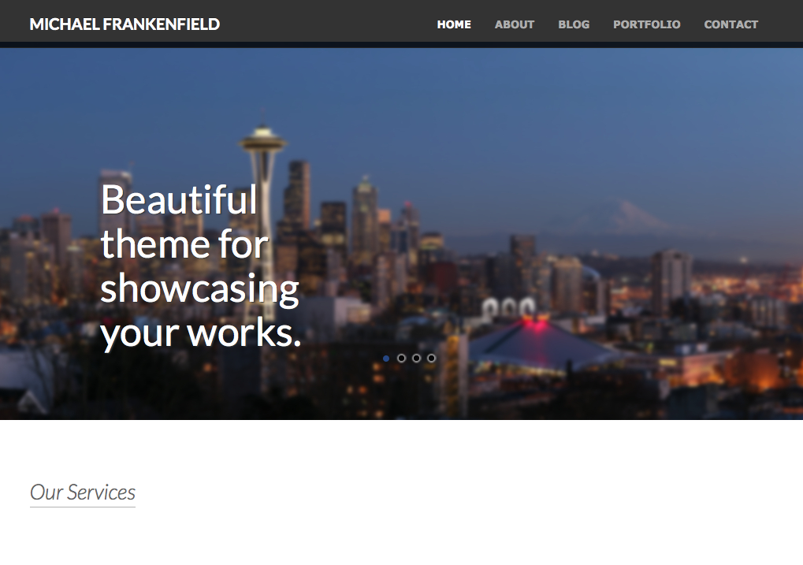

Michael Frankenfield's Portfolio App
====================================

Description
===========

This project is focused on constructing a portfolio website for a web developer.
The application will highlight the developer's portfolio achievements and skillset.
It will provide a viable solution for his lack of current employment.

Check back soon for updates!

Visual Representation
=====================

Home page outline with Bootstrap carousel loaded.

-- Created --
==============
 October 2013
